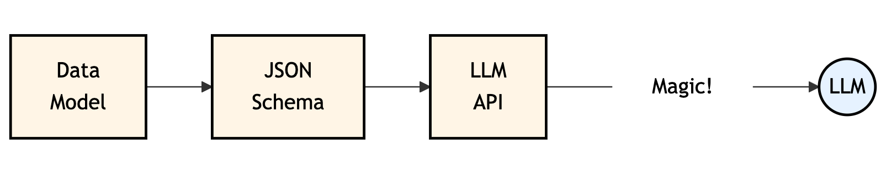
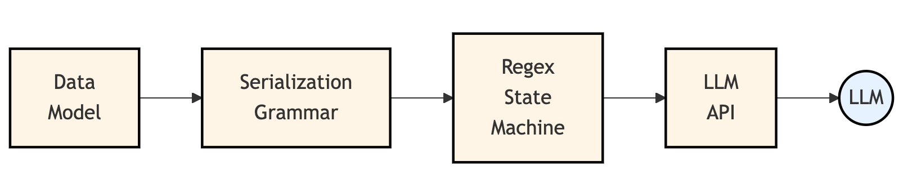

# Planning Agent Demo

A demonstration library for AI agents capable of self-organization and problem-solving through code generation.

## Overview

This project showcases an AI agent framework that can:
- Self-organize to solve complex problems
- Generate code to implement solutions
- Coordinate with other agents/LLMs
- Execute plans with predictable, reliable results

The core concept is a "self-programming" agent that can break down problems, generate executable code, and produce results - essentially functioning as a coding agent with advanced planning capabilities.

## Features

- **Self-organization**: Agents can plan and execute multi-step solutions
- **Code generation**: Automatically produces executable code to solve problems
- **Tool integration**: Easily expandable toolset for agent capabilities
- **Predictable execution**: Optimized for reliability and explainability
- **Performance focus**: Designed for long-term efficiency and speed

## Installation

This project requires Python 3.12+ and uses `uv` for dependency management.

```bash
# Clone the repository
git clone https://github.com/yourusername/planning-agent-demo.git
cd planning-agent-demo

# Install dependencies with uv
uv sync --all-extras
```

## Usage

Currently, this is a library with associated tests. There is no frontend interface.

See the tests directory for examples of how to use the framework:

```python
from planning_agent_demo.callables.self_programmer import SelfProgrammer
from planning_agent_demo.ast.variable import PlaceholderDefinition
from planning_agent_demo.callables.summation import SummationTool

# Create a self-programming agent
agent = SelfProgrammer(
    name="my_agent",
    instructions="Solve problem X by doing Y",
    callables=[SummationTool()],  # Available tools
    inputs=dict(
        a=PlaceholderDefinition(dtype="int", description="Input parameter"),
    ),
    expected_outputs=dict(
        result=PlaceholderDefinition(dtype="int", description="Output value"),
    ),
)

# Execute the agent
result = agent.execute(dict(a=42))
```

## Roadmap

- **Self-healing**: Ability to adapt plans upon failure (coming soon)
- **Expanded toolset**: Additional capabilities for more complex problem-solving
- **Experimental LLM structured outputs**: Convert from langchain to sglang and regex-based code generation instead of JSON structured outputs

One thing I'd like to explore further is a practical API for regex-powered structured data generation.
Currently, structured outputs mainly support JSON via a limited set of JSON Schema features.



SGLang and others are introducing new ways of performing structured LLM generation using regular expressions, which while limited by itself, opens an interesting door when combined with SGLang's interactive generation capabilities.
In effect, the interactive generation allows the Python code to implement a state machine around the regular expressions which are constraining the LLM's generation.
Such a state machine effectively defines a **grammar** around the regex-defined **tokens** being generated.
Combined, these allow you to author a full lexer and parser that, instead of just parsing text into structured data, also creates an infallible template for the LLM to generate that structured data using a syntax better optimized to the problem.

What I'd like to do next is build a simple lexer/parser library (or expand an existing one, such as PyParsing) so the same grammar can be used _both_ for converting text to structure _and_ for constraining LLM text generation.
This can then be wrapped with a convenience layer, e.g. for Pydantic, that splits the problem into **data modeling** on one hand and **(de)serialization format** on the other hand, making it trivial to swap out JSON, XML, CSV, Markdown, YAML, etc. as various ways LLMs can generate structured data, requiring only regex constraints at the actual LLM API layer.



Such an approach is both a superset of JSON Schema-based constrained generation, and also far more capable.
For example, single-token based generation (e.g. for answering multiple choice questions), constrained strings, numeric formats, date formats, and more are efficiently representable with regex-based generation which is not as efficiently possible with JSON Schema.

## Project Status

This project exists for demonstration purposes only. It showcases the potential of AI planning agents in contexts where optimization for long-term performance, reliability, predictability, explainability, and efficiency is crucial.
